# Battery Pack Intelligence — 사용자 매뉴얼

> SL Power 니켈 플레이트 설계 검증기 v0.2.25  
> 최종 업데이트: 2026-04-23

---

## 목차

1. [프로그램 개요](#1-프로그램-개요)
2. [화면 구성](#2-화면-구성)
3. [기본 설정 (좌측 패널)](#3-기본-설정-좌측-패널)
   - 3.1 Cell Type
   - 3.2 홀더 크기
   - 3.3 직렬(S) × 병렬(P)
   - 3.4 Arrangement (배열 방식)
4. [BMS 위치 설정](#4-bms-위치-설정)
5. [B+ / B− 방향 설정](#5-b--b--방향-설정)
6. [고급 설정](#6-고급-설정)
   - 6.1 최대 플레이트 수
   - 6.2 1번 셀 위치
   - 6.3 ICC 제약 조건
   - 6.4 도형 허용
   - 6.5 Display Options
   - 6.6 탐색 시간 제한
7. [커스텀 배열 모드](#7-커스텀-배열-모드)
8. [Generate Layout 실행](#8-generate-layout-실행)
9. [캔버스 뷰](#9-캔버스-뷰)
10. [셀 배열 후보 패널 (우측)](#10-셀-배열-후보-패널-우측)
11. [부분 고정 탐색](#11-부분-고정-탐색)
12. [Pack Summary](#12-pack-summary)
13. [파일 내보내기](#13-파일-내보내기)
14. [자주 묻는 질문](#14-자주-묻는-질문)

---

## 1. 프로그램 개요

**Battery Pack Intelligence**는 SL Power의 니켈 플레이트 설계 검증 도구입니다.  
배터리 셀의 직렬·병렬 조합(S×P), 홀더 형상, 니켈 플레이트 패턴을 시각적으로 탐색하고 검증합니다.

**주요 기능 요약:**

| 기능 | 설명 |
|------|------|
| 셀 배열 렌더링 | 정배열·엇배열·커스텀 배열을 SVG로 정밀 시각화 |
| 그룹 배정 탐색 | 홀더 제약을 만족하는 셀→직렬그룹 배정 자동 열거 |
| 부분 고정 탐색 | 일부 그룹을 수동으로 고정하고 나머지만 자동 탐색 |
| 니켈 플레이트 패턴 | 상면·하면 니켈 연결 패턴 자동 생성 및 검증 |
| 비용 모델 | m_distinct(금형 종류 수) 기반 금형비 추정 |
| SVG / PNG 내보내기 | 설계 결과를 파일로 출력 |

**실행 방법:** `battery_pack_renderer.html` 파일을 웹 브라우저에서 엽니다.  
(Chrome 또는 Edge 권장. 로컬 파일 서버가 없으면 일부 Worker 기능이 제한될 수 있습니다.)

---

## 2. 화면 구성

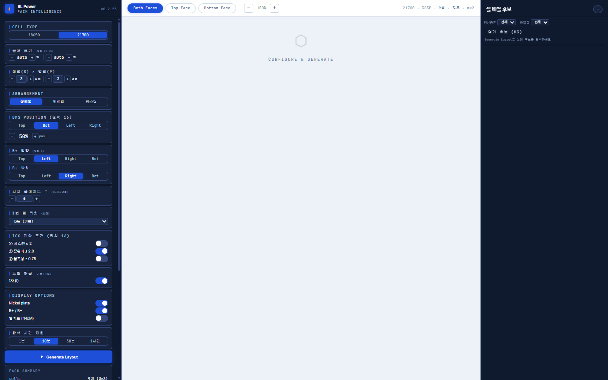

화면은 3개 영역으로 구성됩니다:

```
┌──────────────────┬─────────────────────────────┬──────────────────┐
│   좌측 패널      │        중앙 캔버스           │   우측 패널      │
│  (설정 컨트롤)   │    (SVG 렌더링 뷰)          │  (후보 카드 목록)│
│   약 260px       │       가변 너비              │   약 280px       │
└──────────────────┴─────────────────────────────┴──────────────────┘
```

**상단 바 (캔버스 상단):**

| 요소 | 설명 |
|------|------|
| Both Faces / Top Face / Bottom Face | 표시할 면 선택 |
| − / 100% / + | 캔버스 확대·축소 |
| 우측 상태 텍스트 | 현재 설정 요약 (셀 규격 · S×P · 셀수 · BMS방향 · m값) |

---

## 3. 기본 설정 (좌측 패널)

### 3.1 Cell Type

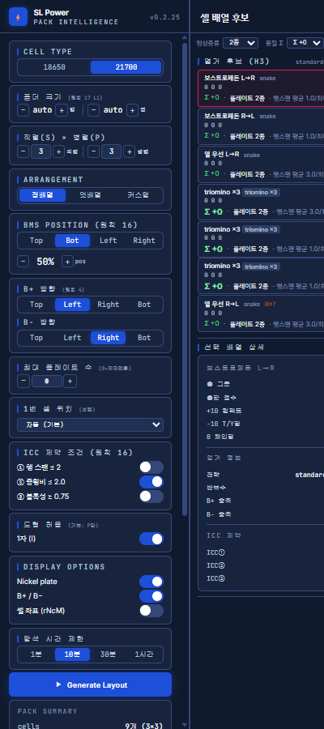

**18650** 또는 **21700** 중 하나를 선택합니다.

| 셀 타입 | 직경 | 주요 용도 |
|---------|------|-----------|
| 18650 | 18 mm | 소형·경량 팩 |
| 21700 | 21 mm | 고용량·고출력 팩 |

선택 버튼을 클릭하면 즉시 적용됩니다. 파란색 배경이 현재 선택된 타입입니다.

---

### 3.2 홀더 크기 (원칙 17 L1)

물리적인 배터리 홀더의 행(row) × 열(column) 크기를 설정합니다.  
`auto`로 두면 S×P 입력값에서 자동 계산됩니다.

**`−` / `+` 버튼**으로 행·열 수를 조정합니다.  
홀더에 빈 슬롯(공란)이 있는 경우 실제 셀 수 < 홀더 슬롯 수가 됩니다.

> **예시:** 13×4 홀더에 52셀을 배치하면 공란 없음.  
> 13×5 홀더에 60셀 중 52셀만 사용하면 8개 공란 발생.

---

### 3.3 직렬(S) × 병렬(P)

배터리 팩의 **직렬 그룹 수(S)**와 **병렬 셀 수(P)**를 설정합니다.

- **S** (Series): 직렬로 연결된 그룹 수. 팩 전압 = 셀 전압 × S
- **P** (Parallel): 각 그룹에 병렬로 연결된 셀 수. 팩 용량 = 셀 용량 × P

총 셀 수 = S × P. `−` / `+` 버튼 또는 숫자 직접 입력으로 변경합니다.

> **지원 범위:** S: 2~13, P: 1~6 (이론 범위)

---

### 3.4 Arrangement (배열 방식)

셀의 물리적 배치 방식을 선택합니다.

| 버튼 | 배열 | 설명 |
|------|------|------|
| **정배열** | Square | 셀이 격자(grid) 형태로 정렬. 홀·짝 행 오프셋 없음 |
| **엇배열** | Staggered | 홀수 행이 pitch/2 오프셋. 헥사고날 밀집 배치. 동일 면적 대비 셀 밀도 높음 |
| **커스텀** | Custom | 행별로 셀 수를 다르게 지정. 불규칙 형상 팩에 사용 |

> **커스텀 배열은 7장에서 별도 설명합니다.**

---

## 4. BMS 위치 설정

BMS(배터리 관리 시스템) 커넥터의 위치를 설정합니다.

### BMS Position 엣지 (원칙 16)

| 버튼 | 의미 |
|------|------|
| **Top** | 홀더 상단 엣지 |
| **Bot** | 홀더 하단 엣지 (기본값) |
| **Left** | 홀더 좌측 엣지 |
| **Right** | 홀더 우측 엣지 |

### BMS Position 비율

`−` / `%` / `+` 버튼으로 BMS 마커의 엣지 상 위치 비율을 조정합니다.  
`50%`이면 엣지의 정중앙, `0%`이면 시작점, `100%`이면 끝점입니다.

캔버스에 **초록색 삼각형 마커**와 **BMS** 라벨로 표시됩니다.

---

## 5. B+ / B− 방향 설정

팩의 양극(B+)과 음극(B−) 출력 단자 방향을 설정합니다.

| 버튼 | 의미 |
|------|------|
| Top | 상단 방향 |
| Left | 좌측 방향 (B+ 기본값) |
| Right | 우측 방향 (B− 기본값) |
| Bot | 하단 방향 |

> **원칙 4:** B+ 방향과 B− 방향은 서로 반대 엣지여야 합니다.  
> 같은 방향으로 설정하면 탐색 결과가 0개가 될 수 있습니다.

---

## 6. 고급 설정

### 6.1 최대 플레이트 수 (0=제한없음)

금형(m_distinct)의 최대 종류 수를 제한합니다.  
`0`이면 제한 없음. `N`으로 설정하면 고유 형상이 N종 초과인 후보는 필터링됩니다.

`−` / `+` 버튼으로 값을 조정합니다.

---

### 6.2 1번 셀 위치 (선택)

B+ 그룹(G0)의 첫 번째 셀 위치 힌트를 제공합니다.

| 옵션 | 의미 |
|------|------|
| 자동 (기본) | B+ 경계 셀 중 자동 선택 |
| TL (Top-Left) | 좌상단 코너 셀 |
| TR (Top-Right) | 우상단 코너 셀 |
| BL (Bottom-Left) | 좌하단 코너 셀 |
| BR (Bottom-Right) | 우하단 코너 셀 |

---

### 6.3 ICC 제약 조건 (원칙 16)

Industrial Compactness Constraint — 제조 실용성 필터입니다.  
토글 ON(파란색)/OFF로 각 제약을 개별 활성화할 수 있습니다.

| 제약 | 조건 | 의미 |
|------|------|------|
| ICC① | 행 스팬 ≤ 2 | 하나의 그룹이 3행 이상 걸치면 금지 |
| ICC② | 종횡비 ≤ 2.0 | 그룹 너비/높이 비율이 2.0 초과면 금지 |
| ICC③ | 볼록성 ≥ 0.75 | 그룹 면적 / 볼록 껍질 면적 비율 |

> 제약을 끄면 더 많은 후보가 탐색되지만, 실제 제조 불가능한 형상이 포함될 수 있습니다.

---

### 6.4 도형 허용 (기본: P만)

그룹 형상 타입을 제한합니다.  
토글 ON이면 P개 셀로 구성된 형상만 허용. OFF이면 다양한 타일링 형상 허용.

---

### 6.5 Display Options

| 옵션 | 설명 |
|------|------|
| **Nickel plate** | 니켈 플레이트 연결선 표시/숨기기 |
| **B+ / B−** | 양·음극 단자 마커 표시/숨기기 |
| **셀 좌표 (rNcM)** | 각 셀 위에 행·열 좌표 표시. 좌표 ON 상태에서 부분 고정 탐색 입력 시 유용 |

---

### 6.6 탐색 시간 제한

자동 탐색의 최대 실행 시간을 설정합니다.

| 버튼 | 시간 |
|------|------|
| 1분 | 60초 |
| **10분** | 600초 (기본값) |
| 30분 | 1800초 |
| 1시간 | 3600초 |

> 대형 팩(S×P가 클수록)은 탐색 공간이 기하급수적으로 커집니다.  
> 10분 이내에 충분한 후보가 나오지 않으면 시간 제한을 늘려 보세요.

---

## 7. 커스텀 배열 모드

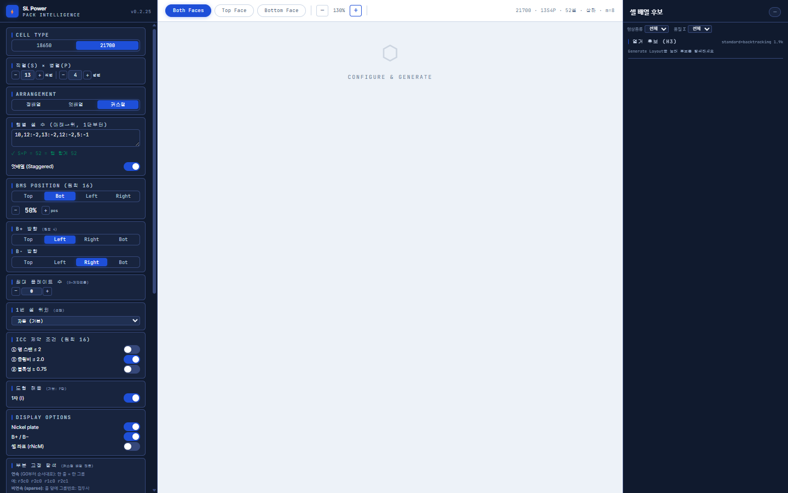

**Arrangement**에서 **커스텀** 버튼을 클릭하면 커스텀 배열 입력 영역이 나타납니다.

### 행별 셀 수 입력

텍스트 박스에 행별 셀 수를 입력합니다.

**형식:**
```
10
12
13
12
10
```
한 줄 = 한 행. 위에서 아래 방향(행 0부터 시작)으로 셀 수를 지정합니다.

**쉼표·콜론 형식도 지원:**
```
10,12:-2,13:-2,12:-5,-1
```
`행수:오프셋` 형식으로 시작 x 오프셋을 지정할 수 있습니다.

**검증 결과:**  
입력 후 `S×P = 52 = 합 맞는지 52` 형태로 셀 수 일치 여부를 실시간 확인합니다.

---

### 엇배열 (Staggered) 토글

커스텀 배열에서 홀수 행을 pitch/2 만큼 오프셋할지 선택합니다.

| 상태 | 의미 |
|------|------|
| ON (파란색) | 홀수 행 pitch/2 오프셋 적용 |
| OFF | 모든 행 동일 x 시작점 |

---

## 8. Generate Layout 실행

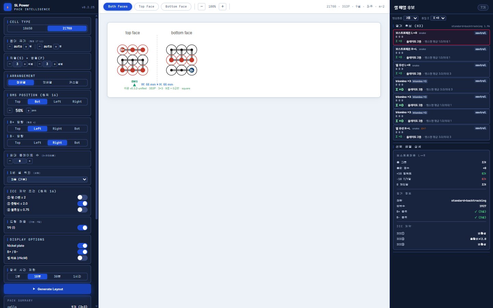

모든 설정을 완료한 후 **Generate Layout** 버튼(파란색)을 클릭합니다.

**실행 과정:**
1. 홀더 그리드 구성 (buildHolderGrid)
2. B+/B− 경계 셀 계산 (calcBoundarySet)
3. 그룹 배정 탐색 시작 (enumerateGroupAssignments — Web Worker 병렬)
4. 후보 탐색 완료 시 첫 번째 후보가 자동 선택되어 캔버스에 렌더링
5. 우측 패널에 전체 후보 목록 표시

**진행 중 표시:**  
상단 바에 `탐색 중... N개` 형태로 실시간 후보 수가 증가합니다.

> **후보 0개가 표시되는 경우:**  
> - S값 대비 홀더 크기가 너무 작음  
> - B+/B− 방향이 같은 엣지로 설정됨  
> - ICC 제약 조건이 모두 ON이고 형상 조건이 너무 엄격함  
> - 탐색 시간 초과 전 후보 없음  
> → 설정을 조정하거나 ICC 제약을 일부 해제해 보세요.

---

## 9. 캔버스 뷰

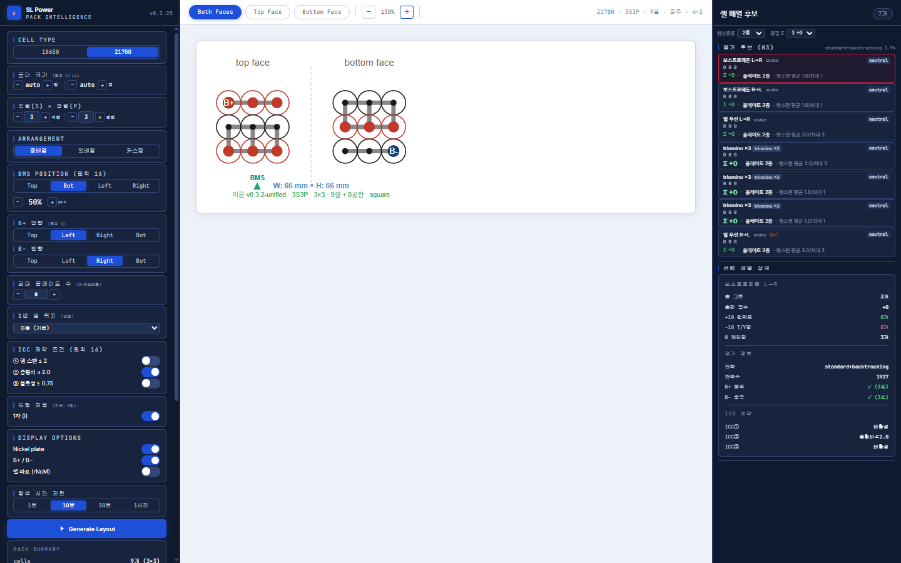

### 면 선택 (Both / Top / Bottom)

| 버튼 | 표시 내용 |
|------|-----------|
| **Both Faces** | 상면(top face)과 하면(bottom face)을 좌우로 나란히 표시 |
| **Top Face** | 상면만 단독 표시. B+ 단자가 있는 면 |
| **Bottom Face** | 하면만 단독 표시. B− 단자가 있는 면 |

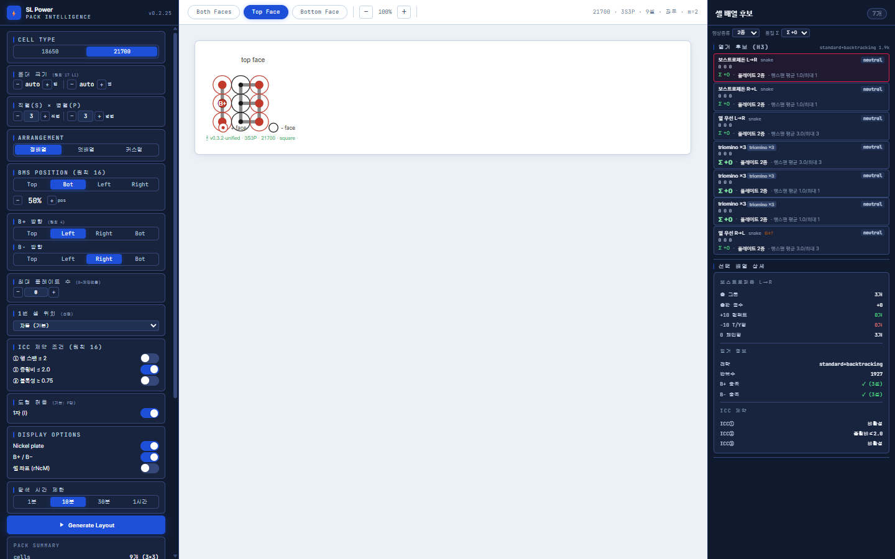

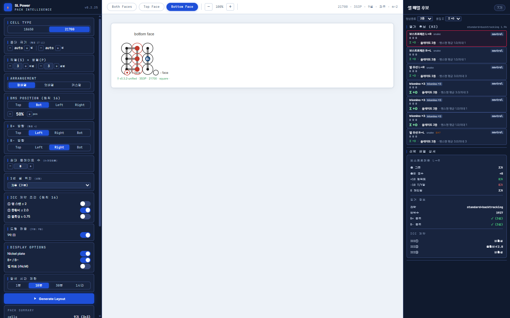

---

### 확대·축소

| 버튼 | 동작 |
|------|------|
| **+** | 10% 확대 |
| **−** | 10% 축소 |
| 숫자 표시 | 현재 배율 (예: 130%) |

---

### 캔버스 SVG 범례

| 시각 요소 | 의미 |
|-----------|------|
| 빨간 테두리 원 | 양극(+) 셀 상면 |
| 검정 테두리 원 | 음극(−) 셀 상면 |
| 빨간 중앙 점 | 하면 음극 마커 |
| 회색 선 | 니켈 플레이트 연결선 |
| 빨간 박스 + 점 | B+ 단자 탭 |
| 파란 박스 + 점 | B− 단자 탭 |
| 초록 삼각형 | BMS 위치 마커 |
| rNcM 텍스트 | 셀 좌표 (Display Options에서 ON시) |

---

### 하단 정보 라벨

캔버스 하단에 현재 렌더 정보가 표시됩니다:

```
이론 v0.3.2-unified · 3S3P · 3×3 · 9셀 + 0공란 · square
W: 66 mm × H: 66 mm
```

| 항목 | 의미 |
|------|------|
| 이론 버전 | 알고리즘 버전 |
| S×P | 직렬·병렬 구성 |
| N×M | 홀더 행×열 |
| 셀 수 + 공란 | 실제 셀 수 + 빈 슬롯 수 |
| 배열 타입 | square / staggered / custom |
| W × H | 팩 외형 크기 (mm) |

---

## 10. 셀 배열 후보 패널 (우측)

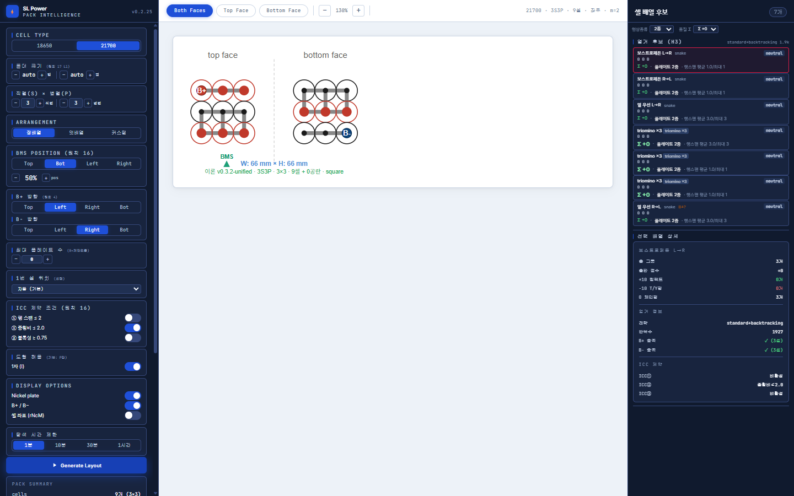

Generate Layout 실행 후 우측 패널에 탐색된 후보 목록이 표시됩니다.

### 후보 카드 구성

각 카드에는 다음 정보가 표시됩니다:

```
보스트로페돈 L→R   snake          neutral
○ ○ ○
Σ +0 · 플레이트 2종 · 행스팬 평균 1.0/최대 1
```

| 요소 | 의미 |
|------|------|
| 배열 이름 | 그룹 배정 방향 전략 (보스트로페돈 L→R / R→L, 열 우선 L→R / R→L, triomino ×3 등) |
| 전략 태그 | snake / triomino 등 탐색 알고리즘 종류 |
| 극성 태그 | neutral / positive / negative (극성 우선도) |
| ○ ○ ○ | 점 3개: 각 직렬 그룹의 B+ 셀 연결 상태 (초록=양호, 적=문제) |
| Σ +0 | 품질 점수 (클수록 우수) |
| 플레이트 N종 | m_distinct — 고유 금형 종류 수 |
| 행스팬 평균/최대 | 그룹이 걸치는 행 수 평균 및 최대값 |

**카드 클릭** → 해당 후보가 캔버스에 렌더링됩니다. 선택된 카드는 **빨간 테두리**로 강조됩니다.

---

### 필터

| 필터 | 설명 |
|------|------|
| **형상종류** | 전체 / 2종 / 3종 등 m_distinct 값으로 필터 |
| **품질 Σ** | 전체 / +0 이상 / +1 이상 등 품질 점수 기준 필터 |

---

### 선택 배열 상세 (우측 패널 하단)

후보를 선택하면 하단에 상세 정보가 펼쳐집니다.

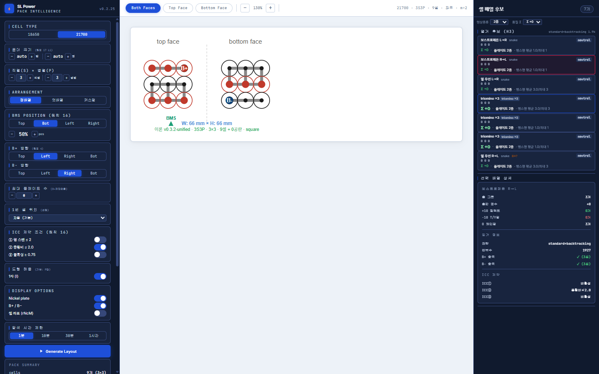

| 항목 | 의미 |
|------|------|
| 배열 이름 | 선택된 후보의 이름 |
| 총 그룹 | 직렬 그룹 수 (= S값) |
| 셀 연 수 | 각 그룹의 셀 연결 수 |
| +10 점프도 | 긍정적 연결 점프 수 |
| -10 T/Y형 | 부정적 T/Y형 연결 수 |
| 0 체인질 | 체인 연결 수 |
| **탐색 결과** | |
| 전략 | 사용된 탐색 알고리즘 |
| 반복수 | 탐색 반복 횟수 |
| B+ 순조 | B+ 경계 셀 연결 성공 여부 |
| B− 순조 | B− 경계 셀 연결 성공 여부 |
| **ICC 결과** | |
| ICC① | 행 스팬 ≤ 2 통과 여부 |
| ICC② | 종횡비 ≤ 2.0 통과 여부 |
| ICC③ | 볼록성 ≥ 0.75 통과 여부 |

---

## 11. 부분 고정 탐색

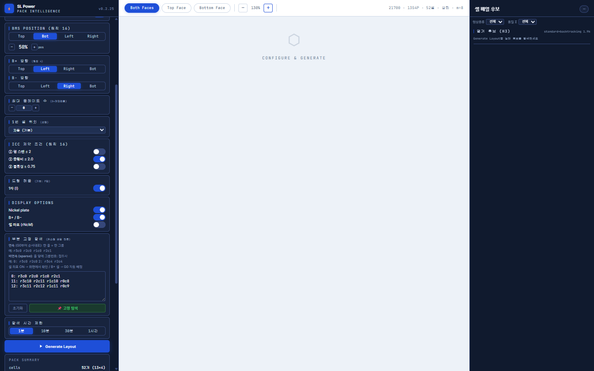

**커스텀 배열 모드**에서만 사용 가능한 기능입니다.  
일부 직렬 그룹의 셀 위치를 수동으로 고정하고, 나머지 그룹만 자동으로 탐색합니다.

### 사용 목적

- B+ 단자 위치를 특정 셀로 고정하고 싶을 때
- 특정 그룹의 형상을 미리 결정해 두고 나머지를 최적화할 때
- 13S5P처럼 대형 팩에서 탐색 공간을 줄여 빠르게 결과를 얻고 싶을 때

---

### 입력 형식 — 연속 모드

G0부터 순서대로 각 그룹의 셀 좌표를 한 줄씩 입력합니다.

```
r3c0 r2c0 r1c0 r2c1
r4c0 r4c1 r3c1 r3c2
```

- 첫 번째 줄 = G0 (자동으로 B+ 그룹 배정)
- 두 번째 줄 = G1
- 이하 동일

**좌표 형식:** `rNcM` = N번째 행(row), M번째 열(column). 0-indexed.

> **셀 좌표 확인 방법:**  
> Display Options에서 **셀 좌표 (rNcM)** 토글을 ON 하면 캔버스에 각 셀 좌표가 표시됩니다.

---

### 입력 형식 — Sparse(비연속) 모드

임의의 그룹 번호를 직접 지정하여 고정합니다. G0와 중간 그룹, 마지막 그룹 등 연속이 아닌 인덱스를 동시에 고정할 수 있습니다.

**형식:**
```
그룹번호: 셀1 셀2 셀3 ...
```

**예시 (기본값 — 13S4P 배열에서 G0, G11, G12 고정):**
```
0: r3c0 r2c0 r1c0 r2c1
11: r3c10 r2c11 r1c10 r0c8
12: r3c11 r2c12 r1c11 r0c9
```

이 경우 G1~G10 (10개 그룹)만 DFS 탐색합니다.

**한 줄 입력도 지원:**
```
0: r3c0 r2c0 r1c0 r2c1 11: r3c10 r2c11 12: r3c11 r2c12
```

---

### 실행 및 초기화

| 버튼 | 동작 |
|------|------|
| **초기화** | 텍스트 박스 내용을 지움 |
| **📌 고정 탐색** | 입력된 고정 그룹을 바탕으로 부분 탐색 시작 |

탐색이 완료되면 후보가 우측 패널에 표시되고 필터가 자동 적용됩니다.

> **주의:** 고정 탐색은 **커스텀 배열 모드**에서만 활성화됩니다.  
> 정배열/엇배열 모드에서는 이 섹션이 표시되지 않습니다.

---

## 12. Pack Summary

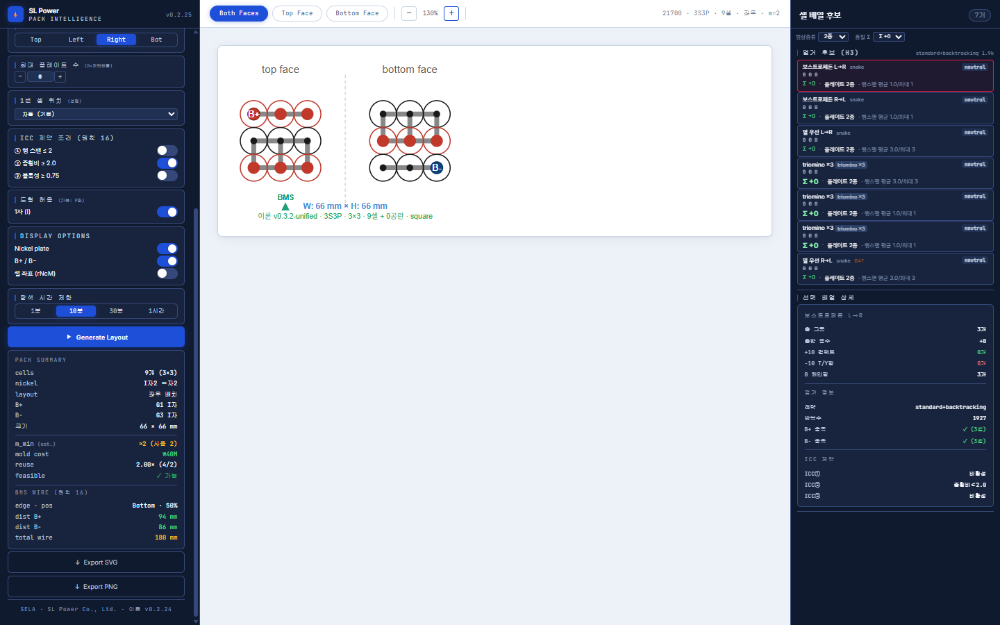

Generate Layout 실행 후 좌측 패널 하단에 현재 선택된 후보의 요약 정보가 표시됩니다.

### 기본 정보

| 항목 | 설명 |
|------|------|
| **cells** | 총 셀 수 (S×P 표기) |
| **nickel** | 니켈 플레이트 수 (상면 + 하면) |
| **layout** | 배열 방향 (좌우 / 상하) |
| **B+** | B+ 단자 위치 (행 인덱스) |
| **B−** | B− 단자 위치 (행 인덱스) |
| **크기** | 팩 외형 치수 W × H (mm) |

### 비용 모델

| 항목 | 설명 |
|------|------|
| **m_min (est.)** | 최소 금형 종류 수 (사용 중 = 실제 m_distinct) |
| **mold cost** | 금형비 추정 (m_distinct × ₩20M) |
| **reuse** | 재사용률 (중복 사용 형상 / 전체 플레이트 수) |
| **feasible** | 제조 가능성 검증 결과 (✓ 가능 / ✗ 불가) |

### BMS Wire (원칙 16)

| 항목 | 설명 |
|------|------|
| **edge · pos** | BMS 마커 위치 (엣지 방향 · 비율%) |
| **dist B+** | BMS에서 B+ 단자까지 맨해튼 거리 (mm) |
| **dist B−** | BMS에서 B− 단자까지 맨해튼 거리 (mm) |
| **total wire** | 총 BMS 와이어 길이 (dist B+ + dist B−) |

> **색상 기준:**  
> - 녹색: 60mm 미만 (짧음, 우수)  
> - 흰색: 60~120mm (보통)  
> - 황색: 120mm 이상 (길음, 주의)

---

## 13. 파일 내보내기

Pack Summary 아래에 두 개의 내보내기 버튼이 있습니다.

| 버튼 | 출력 형식 | 파일명 형식 |
|------|-----------|-------------|
| **↓ Export SVG** | 벡터 SVG 파일 | `{S}s{P}p_{셀타입}_{배열}.svg` |
| **↓ Export PNG** | 래스터 PNG 파일 (2× 해상도) | `{S}s{P}p_{셀타입}_{배열}.png` |

**내보내기 내용:**  
현재 캔버스에 표시된 면 기준으로 내보냅니다.  
- **Both Faces** 선택 시: 상면·하면 둘 다 포함
- **Top Face** 선택 시: 상면만 포함
- **Bottom Face** 선택 시: 하면만 포함

> **고해상도 PNG 팁:**  
> Export PNG는 CSS 픽셀의 2배 해상도로 출력됩니다.  
> 인쇄나 프레젠테이션 사용 시 충분한 품질을 제공합니다.

---

## 14. 자주 묻는 질문

**Q. 후보가 하나도 탐색되지 않습니다.**  
A. 다음 순서로 확인하세요:
1. B+ 방향과 B− 방향이 서로 다른 엣지인지 확인
2. 홀더 크기가 S×P 셀을 수용할 수 있는지 확인 (홀더 슬롯 수 ≥ 셀 수)
3. ICC 제약 조건 중 하나 이상을 OFF로 변경
4. 탐색 시간 제한을 늘려서 재시도

---

**Q. 탐색이 오래 걸립니다.**  
A. 대형 팩(S가 클수록, P가 클수록)은 탐색 공간이 급격히 커집니다.  
부분 고정 탐색(11장)을 활용하면 탐색 공간을 크게 줄일 수 있습니다.

---

**Q. 커스텀 배열에서 `S×P = 합 맞는지` 오류가 납니다.**  
A. 입력한 각 행의 셀 수 합계가 S×P와 일치하지 않습니다.  
셀 수를 다시 계산하거나, S 또는 P 값을 조정하세요.

---

**Q. 부분 고정 탐색에서 셀 좌표를 어떻게 확인하나요?**  
A. Display Options에서 **셀 좌표 (rNcM)** 토글을 ON 하면  
캔버스의 각 셀 위에 `r2c3` 형태로 좌표가 표시됩니다.  
해당 셀의 행(r)과 열(c) 번호를 그대로 입력에 사용하세요.

---

**Q. Export PNG 파일이 어디에 저장되나요?**  
A. 브라우저 기본 다운로드 폴더에 저장됩니다. (보통 `~/Downloads`)

---

**Q. Sparse 형식과 연속 형식을 구분하는 방법은?**  
A. 입력에 `숫자:` 패턴(그룹 번호 + 콜론)이 포함되어 있으면 Sparse 모드로 자동 인식합니다.  
없으면 연속 모드(G0부터 순서대로)로 처리됩니다.

---

*Battery Pack Intelligence — SL Power Co., Ltd. · SELA*  
*이론 v0.2.24 / 앱 v0.2.25*
